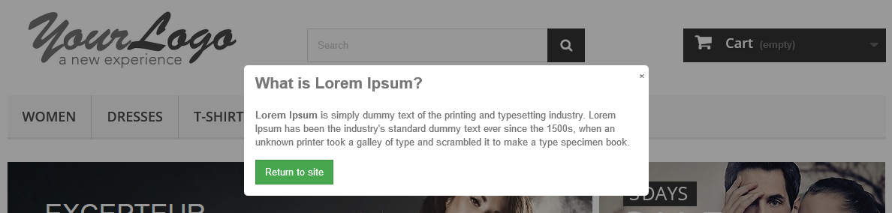
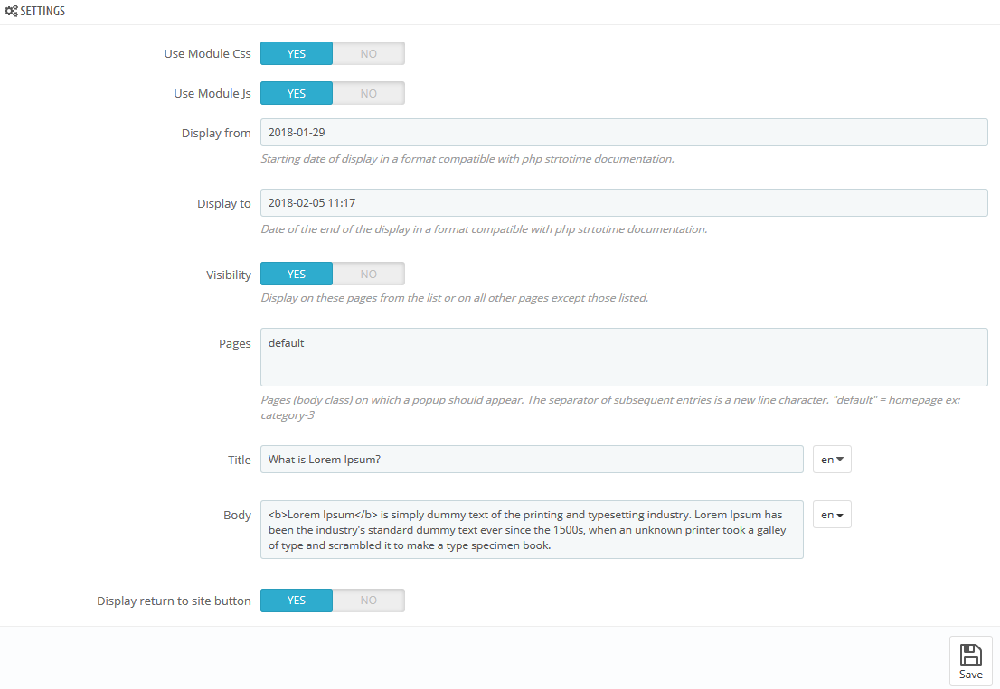

# Popup for PrestaShop

Enables you to display popup on selected pages of the website.

Compatible with versions 1.6.x - 1.7.x

### Installing

1) Close the repository

2) Enter the cd mcps_popup directory

3) Run "composer install" in the command line.

## Authors

* **Marek Ciarkowski** - [mcmaroon](https://github.com/mcmaroon)

## License

This project is licensed under the MIT License - see the [LICENSE](LICENSE) file for details